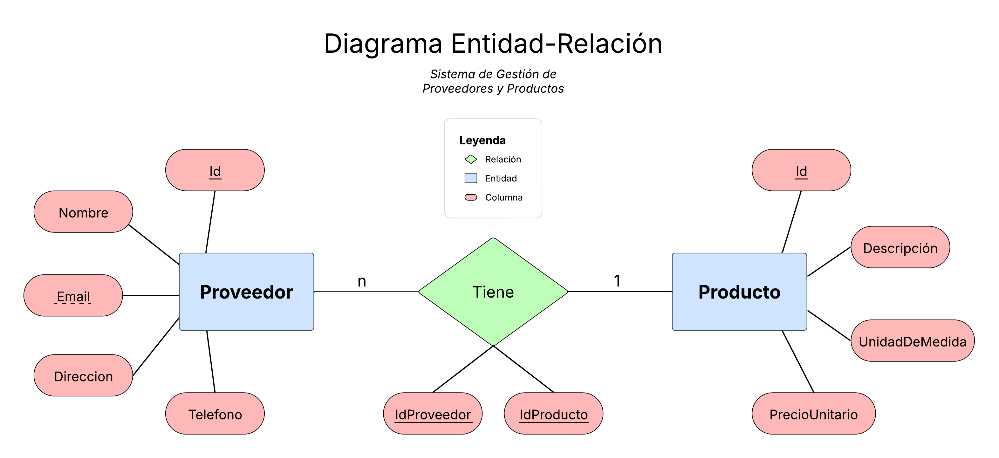

<h1 align="center">
  <a href="#"> Sistema de Gestión de Proveedores y Productos </a>
</h1>

<h3 align="center">Prueba Técnica</h3>

  

  

 <a href="#descripción">Descripción</a> •
 <a href="#entregables">Entregables</a> •
 <a href="#alcance">Features</a> •
 <a href="#especificaciones">Tech Stack</a> •  
 <a href="#autor">Autor</a>

## Descripción

Este proyecto se desarrolló como parte de una prueba técnica para un puesto de trabajo. Consiste en un sistema para gestionar entidades de **Proveedores**, **Productos** y la **relación** entre ellos. Para ello se desarrolla una **API** que será consumida por una aplicación Web.

---

## Entregables

## 1. Diseño de Base de Datos (SQL)
### Diagrama de entidad-relación (ER).

### [Script SQL para crear tablas.](SGPP/SGPP_Database/Scripts/DatabaseCreationScript.sql)
[Abrir](SGPP/SGPP_Database/Scripts/DatabaseCreationScript.sql)

## 2. API REST

#### [GET /api/proveedor](SGPP/SGPP_API/Controllers/ProveedoresAPIController.cs) → Listar proveedores.
#### [GET /api/proveedor/id](SGPP/SGPP_API/Controllers/ProveedoresAPIController.cs) → Listar un proveedor.
#### [POST /api/proveedor](SGPP/SGPP_API/Controllers/ProveedoresAPIController.cs) → Crear proveedor.
#### [PUT /api/ proveedor/:id](SGPP/SGPP_API/Controllers/ProveedoresAPIController.cs) → Actualizar proveedor.
#### [DELETE /api/proveedor/:id](SGPP/SGPP_API/Controllers/ProveedoresAPIController.cs) → Eliminar proveedor.
# 
#### [GET /api/producto](SGPP/SGPP_API/Controllers/ProductosAPIController.cs) → Listar Productos.
#### [GET /api/producto/id](SGPP/SGPP_API/Controllers/ProductosAPIController.cs) → Listar un producto.
#### [POST /api/producto](SGPP/SGPP_API/Controllers/ProductosAPIController.cs) → Crear producto.
#### [PUT /api/ producto/:id](SGPP/SGPP_API/Controllers/ProductosAPIController.cs) → Actualizar producto.
#### [DELETE /api/producto/:id](SGPP/SGPP_API/Controllers/ProductosAPIController.cs) → Eliminar producto.

---

## Alcance

- [x] Base de datos: Proyecto que despliega una base con sus tablas respectivas y algunos datos de prueba. Se provee tanto el script de creación, como el proyecto de base de datos en Visual Studio (2 opciones).
- [x] Backend: API RESTful desarrollada con Controladores, los cuales definen los *endpoints* a ser consumidos.
- [x] Frontend: Vistas desarrolladas en páginas **.razor**, complementadas con Bootstrap y que consumen los endpoints del backend.
- [X] Diagrama Entidad-Relación para representar el modelo lógico de datos.
- [X] Funcionalidad correcta para leer, registrar, modificar y eliminar entidades de la base de datos.
- [ ] Autenticación JWT desarrollada parcialmente, no implementada por completo.
- [ ] Uso de Linq en el *front-end*.
- [ ] Filtros y búsquedas en las vistas de las entidades.

---

## Especificaciones

El *stack* tecnológico del proyecto incluye:

- **[C#](https://learn.microsoft.com/en-us/dotnet/csharp/)**
- **[.NET 8](https://dotnet.microsoft.com/en-us/download/dotnet/8.0)**
- **[Bootstrap](https://getbootstrap.com/)**
- **[Microsoft SQL Server](https://www.microsoft.com/en-us/sql-server/sql-server-downloads)**
- **[ASP.NET CORE](https://dotnet.microsoft.com/en-us/apps/aspnet)**
- **[Onion Model (Clean Architecture)](https://blog.cleancoder.com/uncle-bob/2012/08/13/the-clean-architecture.html)**

---

## Autor

<a href="https://www.linkedin.com/in/david-s%C3%A1nchez-l%C3%B3pez-52b640284/">
 
<b>David Sánchez López</b>
</a>
